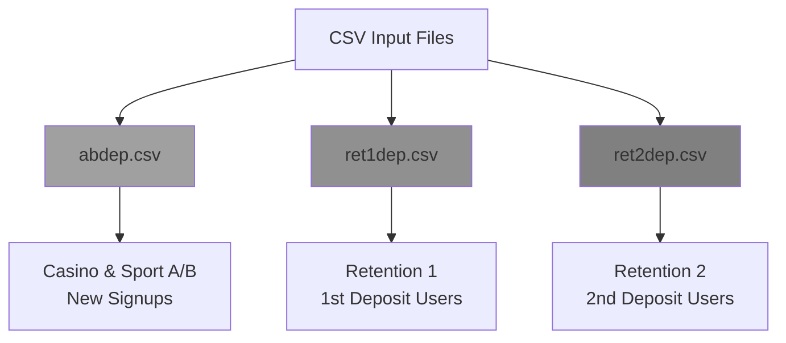
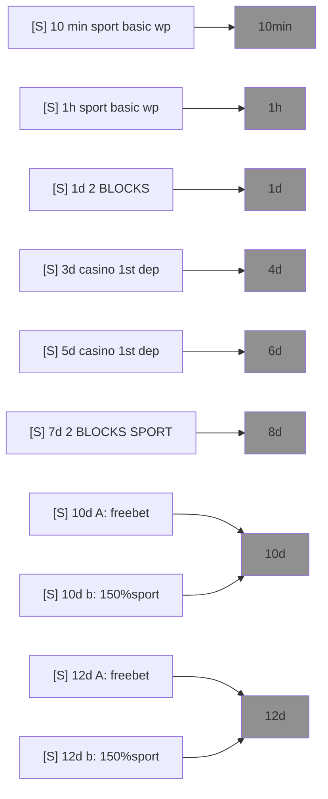
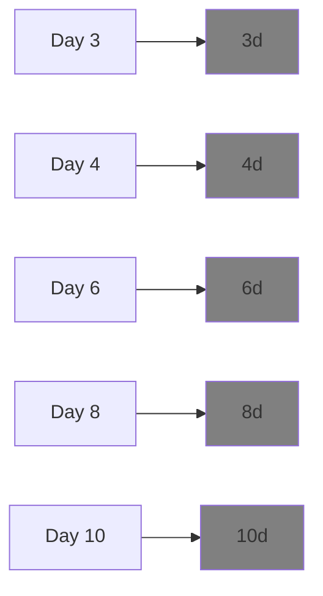
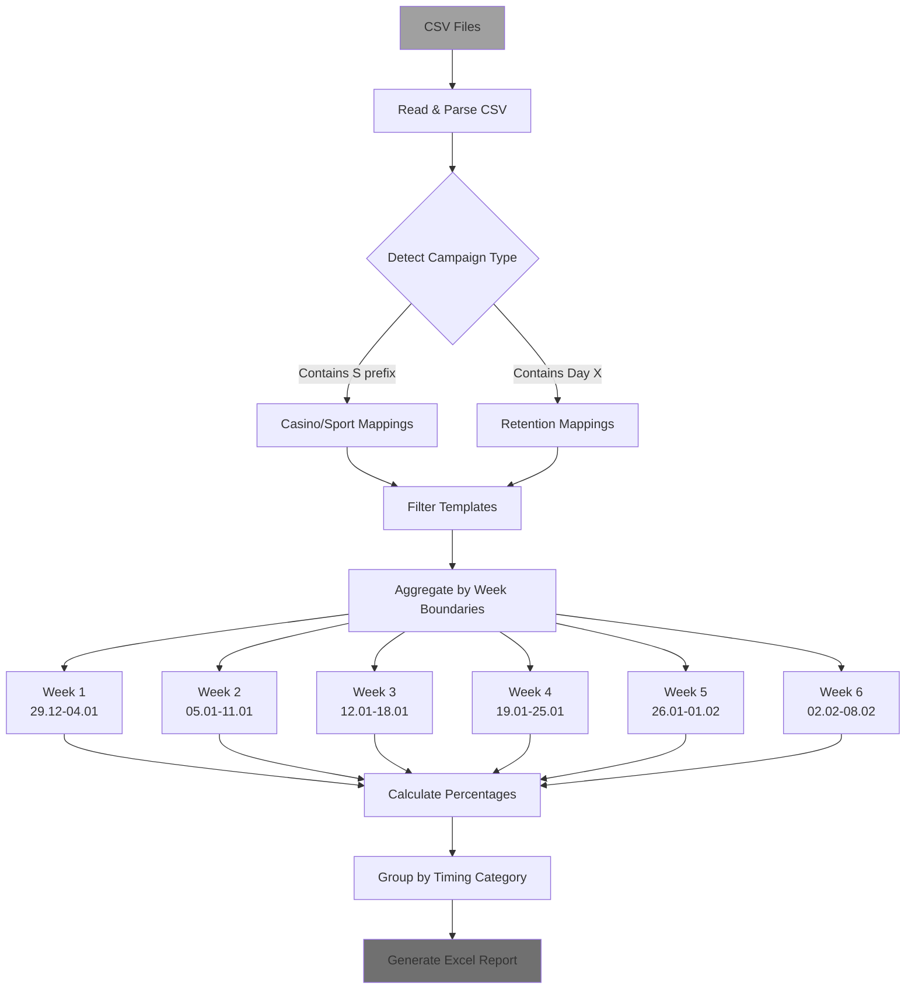
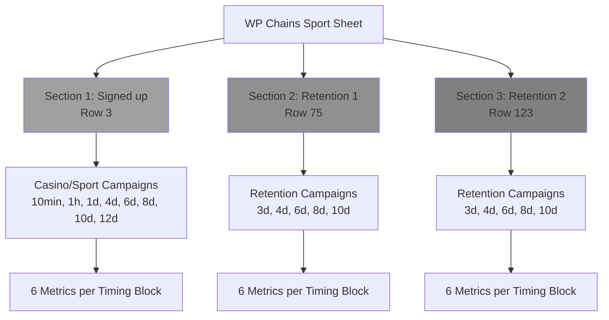
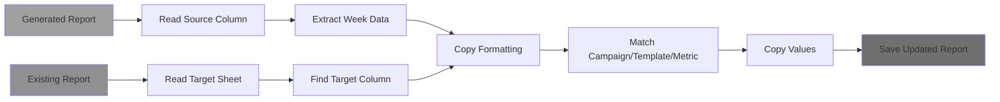

# Casino-Ret Report Type - Data Structure Analysis

## Overview

The `casino-ret` report type processes marketing campaign data from CSV files and generates/updates Excel reports with week-based metrics. It handles two campaign categories:
1. **Casino & Sport A/B campaigns** - New user signups
2. **Retention campaigns** - Existing users (1st and 2nd deposits)

---

## Source Data Structure (CSV Files)

### CSV File Format

```
timestamp,timestamp_RFC3339,template_id,template_name,channel,subject,campaign_id,campaign_name,sent,delivered,opened,clicked,converted,bounced,spammed,unsubscribed,suppressed,failed,drafted,topic_unsubscribed
```

### Required Columns

| Column | Type | Description |
|--------|------|-------------|
| `timestamp` | Unix timestamp | Campaign send time (seconds since epoch) |
| `template_name` | String | Template identifier (e.g., "[S] 10 min sport basic wp", "Day 3") |
| `campaign_name` | String | Campaign identifier (e.g., "casino+sport A/B Reg_No_Dep", "Ret 1 dep [SPORT] ⚽️") |
| `sent` | Integer | Number of emails sent |
| `delivered` | Integer | Number of emails delivered |
| `opened` | Integer | Number of emails opened |
| `clicked` | Integer | Number of clicks |
| `converted` | Integer | Number of conversions |
| `unsubscribed` | Integer | Number of unsubscribes |

### Input File Types



---

## Template Mappings

### Casino & Sport Templates

Maps CSV template names to timing categories in the Excel report:



**Python Mapping:**
```python
CASINOSPORT_MAPPINGS = {
    "[S] 10 min sport basic wp": "10min",
    "[S] 1h sport basic wp": "1h",
    "[S] 1d 2 BLOCKS (basic wp + highroller)": "1d",
    "[S] 3d casino 1st dep total wp": "4d",
    "[S] 5d casino 1st dep": "6d",
    "[S] 7d 2 BLOCKS SPORT + CAS": "8d",
    "[S] 10d A: freebet + 100fs": "10d",
    "[S] 10d b: 150%sport + 100fs": "10d",
    "[S] 12d A: freebet + 100fs": "12d",
    "[S] 12d b: 150%sport + 100fs": "12d",
}
```

### Retention Templates

Maps CSV template names to timing categories:



**Python Mapping:**
```python
RETENTION_MAPPINGS = {
    "Day 3": "3d",
    "Day 4": "4d",
    "Day 6": "6d",
    "Day 8": "8d",
    "Day 10": "10d"
}
```

---

## Data Processing Flow



### Week Boundaries

```python
WEEKLY_BOUNDARIES = [
    ("2025-12-29", "2026-01-04"),  # Week 1
    ("2026-01-05", "2026-01-11"),  # Week 2
    ("2026-01-12", "2026-01-18"),  # Week 3
    ("2026-01-19", "2026-01-25"),  # Week 4
    ("2026-01-26", "2026-02-01"),  # Week 5
    ("2026-02-02", "2026-02-08"),  # Week 6
]
```

---

## Target Excel Structure

### Sheet Layout

```
┌─────────────────────────────────────────────────────────────────┐
│ WP Chains Sport                                                 │
├─────────────────────────────────────────────────────────────────┤
│     A          B              C       D         E    F    G  ... │
│                                              Week6 Week5 Week4   │
│                                              02.02 26.01 19.01   │
├─────────────────────────────────────────────────────────────────┤
│ Row 3: Signed up                                                │
│        casino+sport A/B Reg_No_Dep                              │
│                      10min   Sent      100  200  300            │
│                              Delivered  95  190  285            │
│                              Opened     20   40   60            │
│                              Clicked     5   10   15            │
│                              Unsubscribed 1    2    3            │
│                              Pct Delivered 95% 95% 95%          │
│                      1h      ...                                │
│                      1d      ...                                │
│                      4d      ...                                │
│                      6d      ...                                │
│                      8d      ...                                │
│                      10d     ...                                │
│                      12d     ...                                │
├─────────────────────────────────────────────────────────────────┤
│ Row 75: deposits_quantity is 1                                  │
│         Ret 1 dep [SPORT] ⚽️                                    │
│                      3d      Sent      ...                      │
│                      4d      ...                                │
│                      6d      ...                                │
│                      8d      ...                                │
│                      10d     ...                                │
├─────────────────────────────────────────────────────────────────┤
│ Row 123: deposits_quantity is 2                                 │
│          Ret 2 dep [SPORT] ⚽️                                   │
│                      3d      Sent      ...                      │
│                      4d      ...                                │
│                      6d      ...                                │
│                      8d      ...                                │
│                      10d     ...                                │
└─────────────────────────────────────────────────────────────────┘
```

### Section Structure



### Timing Block Row Mappings

```python
TIMING_BLOCKS = {
    "10min": {"casino_rows": [3, 8]},
    "1h":    {"casino_rows": [9, 14]},
    "1d":    {"casino_rows": [15, 20]},
    "3d":    {"casino_rows": [21, 26], "section_1_rows": [93, 98], "section_2_rows": [141, 146]},
    "4d":    {"casino_rows": [27, 32], "section_1_rows": [99, 104], "section_2_rows": [147, 152]},
    "6d":    {"casino_rows": [33, 38], "section_1_rows": [105, 110], "section_2_rows": [153, 158]},
    "8d":    {"casino_rows": [39, 44], "section_1_rows": [111, 116], "section_2_rows": [159, 164]},
    "10d":   {"casino_rows": [45, 50], "section_1_rows": [117, 122], "section_2_rows": [165, 170]},
    "12d":   {"casino_rows": [51, 56]},
}
```

### Metrics per Block

Each timing block contains 6 rows of metrics:

| Row Offset | Metric | Description |
|------------|--------|-------------|
| +0 | Sent | Total emails sent |
| +1 | Delivered | Total emails delivered |
| +2 | Opened | Total emails opened |
| +3 | Clicked | Total clicks |
| +4 | Unsubscribed | Total unsubscribes |
| +5 | Pct Delivered | Percentage delivered (calculated) |

### Week Column Mappings

```python
WEEK_COLUMNS = {
    'week1': 'J',  # Week 1 (29.12)
    'week2': 'I',  # Week 2 (05.01)
    'week3': 'H',  # Week 3 (12.01)
    'week4': 'G',  # Week 4 (19.01)
    'week5': 'F',  # Week 5 (26.01)
    'week6': 'E'   # Week 6 (02.02)
}
```

---

## Week Replacement Feature

### Overview

Updates specific week columns in existing Excel reports without regenerating the entire file.



### Week Column Mappings

```python
WEEK_MAPPINGS = {
    'source': {
        '01': 'J',   # Generated report columns
        '02': 'I',
        '03': 'H',
        '04': 'G',
        '05': 'F',
        '06': 'E'
    },
    'target': {
        '01': 'BF',  # Existing report columns
        '02': 'BE',
        '03': 'BD',
        '04': 'BC',
        '05': 'BB',
        '06': 'BA'
    }
}
```

---

## File Naming Requirements

### Critical: Avoid Ambiguous Numbers

File names must not contain ambiguous numeric patterns:

❌ **Bad Examples:**
```
ret1dep19-2.csv    # Contains "1" in multiple places
ret2dep19-2.csv    # Contains both "1" and "2"
```

✅ **Good Examples:**
```
abdep.csv
ret1dep.csv
ret2dep.csv
```

---

## Summary

### Key Features

✅ Multi-file processing (3 CSV files)  
✅ Template mapping (15 unique templates)  
✅ Week aggregation (6 weekly periods)  
✅ Percentage calculation  
✅ Week replacement  
✅ Data validation  

### Output

- **Target Sheet:** `WP Chains Sport`
- **Sections:** 3 (Signed up, Retention 1, Retention 2)
- **Timing Blocks:** 8 for casino, 5 for retention
- **Metrics per Block:** 6 rows
- **Week Columns:** 6 (E-J in generated, BA-BF in existing)
