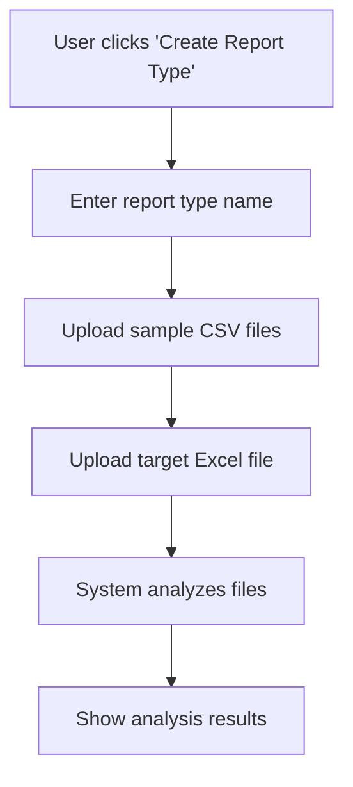
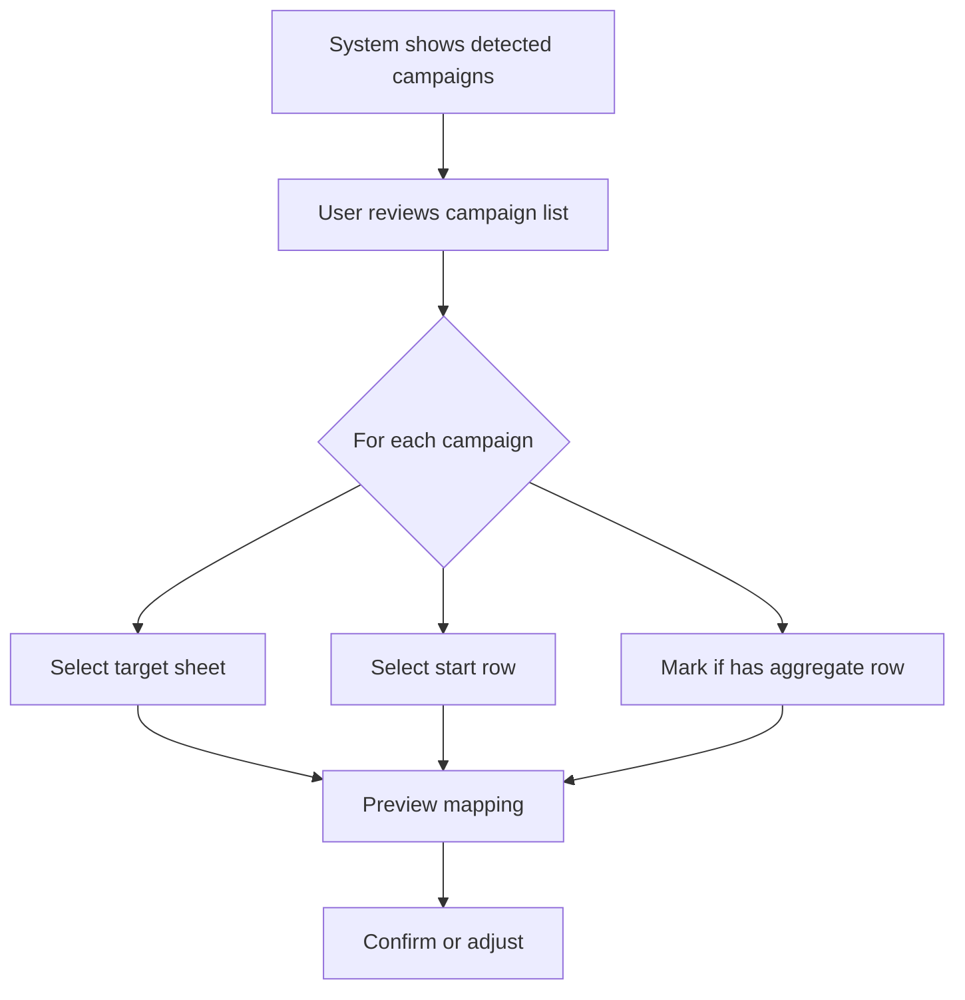
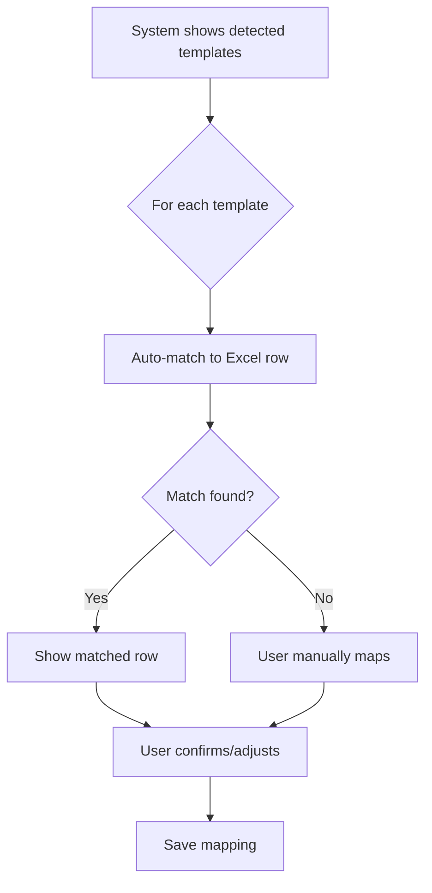
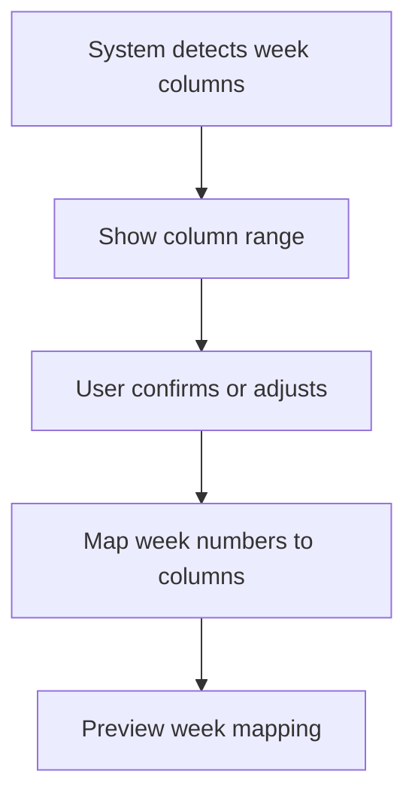
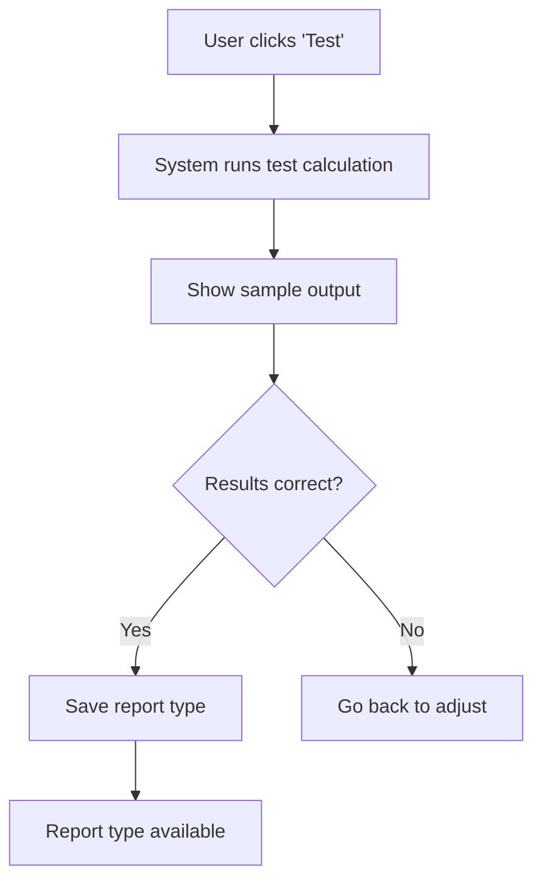
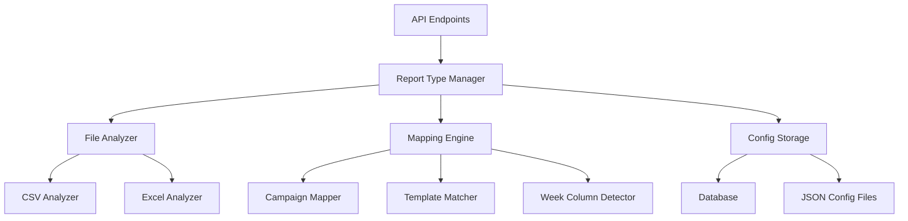

# Feature: User-Driven Report Type Builder

## Overview

Allow users to create and modify report types through a UI wizard instead of requiring AI agents or developers to write code. Users upload source CSV files and target Excel files, then configure mappings through an interactive interface.

---

## Problem Statement

**Current State:**
- Creating new report types requires developer/AI agent intervention
- Users must provide files and wait for implementation
- No way to modify existing report types without code changes
- Mappings are hardcoded in Python files

**Desired State:**
- Users can create report types themselves via UI
- Mappings stored in database/config files (not code)
- Users can modify mappings without developer help
- Instant preview and validation

---

## User Journey

### Phase 1: Upload Files



**UI Components:**
- Report type name input
- Multi-file CSV uploader
- Single Excel file uploader
- Analysis progress indicator

### Phase 2: Configure Campaign Mappings



**UI Components:**
- Campaign list with checkboxes
- Sheet dropdown selector
- Row number input
- Aggregate row toggle
- Live Excel preview

### Phase 3: Configure Template Mappings



**UI Components:**
- Template list with search/filter
- Excel row selector with preview
- Auto-match confidence indicator
- Manual override option
- Bulk mapping tools

### Phase 4: Configure Week Columns



**UI Components:**
- Column range selector (e.g., F-BE)
- Week number to column mapper
- Visual column preview

### Phase 5: Test & Save



**UI Components:**
- Test button
- Sample data preview
- Validation results
- Save/Cancel buttons

---

## Data Model

### Report Type Configuration

```json
{
  "id": "slot",
  "name": "Slot Report",
  "description": "Sport campaign data with template-level granularity",
  "created_at": "2026-02-15T10:00:00Z",
  "created_by": "user@example.com",
  "version": 1,
  "status": "active",
  
  "source_files": {
    "csv_pattern": "SLOT_*.csv",
    "required_columns": ["timestamp", "template_name", "campaign_name", "sent", "delivered", "opened", "clicked", "unsubscribed"]
  },
  
  "target_file": {
    "template_name": "SLOT_ChainsReport_2026.xlsx",
    "sheets": ["WP Chains Sport", "AWOL Chains Sport"]
  },
  
  "campaign_mappings": [
    {
      "campaign_name": "Reg_No_Dep (casino/sport)",
      "target_sheet": "WP Chains Sport",
      "start_row": 3,
      "has_aggregate_row": true
    },
    {
      "campaign_name": "Retention 1 dep (sport)",
      "target_sheet": "WP Chains Sport",
      "start_row": 51,
      "has_aggregate_row": true
    }
  ],
  
  "template_mappings": [
    {
      "campaign_name": "Reg_No_Dep (casino/sport)",
      "templates": [
        {
          "csv_template_name": "Day 2 - Sport Welcome bonus ",
          "excel_row": 11,
          "excel_column_b": "Day 2 - Sport Welcome bonus ",
          "match_type": "exact"
        },
        {
          "csv_template_name": "Day 4 - Sport Welcome bonus reminder",
          "excel_row": 19,
          "excel_column_b": "Day 4 - Sport Welcome bonus reminder",
          "match_type": "exact"
        }
      ]
    }
  ],
  
  "week_columns": {
    "range": "BE-AX",
    "mappings": {
      "01": "BE",
      "02": "BD",
      "03": "BC",
      "04": "BB",
      "05": "BA",
      "06": "AZ",
      "07": "AY",
      "08": "AX"
    }
  },
  
  "metrics": {
    "data_rows": 5,
    "formula_rows": 3,
    "row_structure": [
      {"offset": 0, "name": "Sent", "type": "data"},
      {"offset": 1, "name": "Delivered", "type": "data"},
      {"offset": 2, "name": "Opened", "type": "data"},
      {"offset": 3, "name": "Clicked", "type": "data"},
      {"offset": 4, "name": "Unsubscribed", "type": "data"},
      {"offset": 5, "name": "% Delivered", "type": "formula"},
      {"offset": 6, "name": "% Open", "type": "formula"},
      {"offset": 7, "name": "% Click", "type": "formula"}
    ]
  }
}
```

---

## UI Wireframes

### Screen 1: Create Report Type

```
┌─────────────────────────────────────────────────────────────┐
│ Create New Report Type                                   [X] │
├─────────────────────────────────────────────────────────────┤
│                                                               │
│  Report Type Name: [_________________________]               │
│                                                               │
│  Description: [________________________________________]      │
│               [________________________________________]      │
│                                                               │
│  ┌─────────────────────────────────────────────────────┐    │
│  │ Upload Source CSV Files                              │    │
│  │                                                       │    │
│  │  [Drag & Drop or Click to Upload]                    │    │
│  │                                                       │    │
│  │  ✓ SLOT_rnd_feb15.csv (4462 rows)                    │    │
│  │  ✓ SLOT_ret1_feb15.csv (920 rows)                    │    │
│  │  ✓ SLOT_ret2_feb15.csv (920 rows)                    │    │
│  │  + Add more files                                     │    │
│  └─────────────────────────────────────────────────────┘    │
│                                                               │
│  ┌─────────────────────────────────────────────────────┐    │
│  │ Upload Target Excel File                             │    │
│  │                                                       │    │
│  │  [Drag & Drop or Click to Upload]                    │    │
│  │                                                       │    │
│  │  ✓ SLOT_ChainsReport_2026.xlsx                       │    │
│  │    Sheets: WP Chains Sport, AWOL Chains Sport        │    │
│  └─────────────────────────────────────────────────────┘    │
│                                                               │
│                          [Cancel]  [Next: Analyze Files]     │
└─────────────────────────────────────────────────────────────┘
```

### Screen 2: Campaign Mapping

```
┌─────────────────────────────────────────────────────────────┐
│ Configure Campaign Mappings                    Step 2 of 5   │
├─────────────────────────────────────────────────────────────┤
│                                                               │
│  Detected Campaigns (7):                                     │
│                                                               │
│  ┌─────────────────────────────────────────────────────┐    │
│  │ ☑ Reg_No_Dep (casino/sport)                         │    │
│  │   Target Sheet: [WP Chains Sport ▼]                 │    │
│  │   Start Row: [3]  ☑ Has aggregate row               │    │
│  │   [Preview in Excel →]                               │    │
│  ├─────────────────────────────────────────────────────┤    │
│  │ ☑ Retention 1 dep (sport)                           │    │
│  │   Target Sheet: [WP Chains Sport ▼]                 │    │
│  │   Start Row: [51]  ☑ Has aggregate row              │    │
│  │   [Preview in Excel →]                               │    │
│  ├─────────────────────────────────────────────────────┤    │
│  │ ☑ Retention 2 dep (sport)                           │    │
│  │   Target Sheet: [WP Chains Sport ▼]                 │    │
│  │   Start Row: [91]  ☑ Has aggregate row              │    │
│  │   [Preview in Excel →]                               │    │
│  └─────────────────────────────────────────────────────┘    │
│                                                               │
│                          [Back]  [Next: Template Mapping]    │
└─────────────────────────────────────────────────────────────┘
```

### Screen 3: Template Mapping

```
┌─────────────────────────────────────────────────────────────┐
│ Configure Template Mappings                    Step 3 of 5   │
├─────────────────────────────────────────────────────────────┤
│                                                               │
│  Campaign: [Reg_No_Dep (casino/sport) ▼]                    │
│  Sheet: WP Chains Sport                                      │
│                                                               │
│  [Auto-match All]  Search CSV: [_____________]               │
│                                                               │
│  ┌─────────────────────────────────────────────────────┐    │
│  │ Excel Row │ Excel Template Name   │ CSV Source      │    │
│  ├───────────┼───────────────────────┼─────────────────┤    │
│  │ 11        │ Day 2 - Sport Welcome │ [Select CSV ▼]  │    │
│  │           │ bonus                 │ ✓ Day 2 - Sport │    │
│  │           │                       │   Welcome...    │    │
│  ├───────────┼───────────────────────┼─────────────────┤    │
│  │ 19        │ Day 4 - Sport Welcome │ [Select CSV ▼]  │    │
│  │           │ bonus                 │ ✓ Day 4 - Sport │    │
│  │           │                       │   Welcome...    │    │
│  ├───────────┼───────────────────────┼─────────────────┤    │
│  │ 27        │ Day 13 - Sport        │ [Select CSV ▼]  │    │
│  │           │ Welcome bonus         │ ✓ Day 13 - Spor │    │
│  ├───────────┼───────────────────────┼─────────────────┤    │
│  │ 35        │ Day 15 - Sport        │ [Select CSV ▼]  │    │
│  │           │ Welcome bonus         │ ✓ Day 15 - Spor │    │
│  ├───────────┼───────────────────────┼─────────────────┤    │
│  │ 43        │ Day 20 - Sport        │ [Select CSV ▼]  │    │
│  │           │ Highroller            │ ✓ Day 20 - Spor │    │
│  └─────────────────────────────────────────────────────┘    │
│                                                               │
│  5 of 5 Excel rows mapped  [View unmapped CSV templates]    │
│                                                               │
│                          [Back]  [Next: Week Columns]        │
└─────────────────────────────────────────────────────────────┘
```

### Screen 4: Week Column Configuration

```
┌─────────────────────────────────────────────────────────────┐
│ Configure Week Columns                         Step 4 of 5   │
├─────────────────────────────────────────────────────────────┤
│                                                               │
│  Week Column Range: From [BE ▼] To [AX ▼]                   │
│                                                               │
│  ┌─────────────────────────────────────────────────────┐    │
│  │ Week Number │ Excel Column │ Date Range             │    │
│  ├─────────────┼──────────────┼────────────────────────┤    │
│  │ Week 01     │ [BE ▼]       │ 2026-01-05 - 2026-01-11│    │
│  │ Week 02     │ [BD ▼]       │ 2026-01-12 - 2026-01-18│    │
│  │ Week 03     │ [BC ▼]       │ 2026-01-19 - 2026-01-25│    │
│  │ Week 04     │ [BB ▼]       │ 2026-01-26 - 2026-02-01│    │
│  │ Week 05     │ [BA ▼]       │ 2026-02-02 - 2026-02-08│    │
│  │ Week 06     │ [AZ ▼]       │ 2026-02-09 - 2026-02-15│    │
│  │ Week 07     │ [AY ▼]       │ 2026-02-16 - 2026-02-22│    │
│  │ Week 08     │ [AX ▼]       │ 2026-02-23 - 2026-03-01│    │
│  └─────────────────────────────────────────────────────┘    │
│                                                               │
│  [Auto-detect from Excel]                                    │
│                                                               │
│                          [Back]  [Next: Test & Save]         │
└─────────────────────────────────────────────────────────────┘
```

### Screen 5: Test & Save

```
┌─────────────────────────────────────────────────────────────┐
│ Test & Save Report Type                        Step 5 of 5   │
├─────────────────────────────────────────────────────────────┤
│                                                               │
│  Configuration Summary:                                      │
│  • Report Type: slot                                         │
│  • Campaigns: 7 mapped                                       │
│  • Templates: 27 mapped                                      │
│  • Week Columns: 8 configured                                │
│                                                               │
│  ┌─────────────────────────────────────────────────────┐    │
│  │ Test Calculation                                     │    │
│  │                                                       │    │
│  │ Using: SLOT_rnd_feb15.csv (Week 7)                   │    │
│  │                                                       │    │
│  │ ✓ Campaign detected: Reg_No_Dep (casino/sport)      │    │
│  │ ✓ Week filtered: 2026-02-09 to 2026-02-15           │    │
│  │ ✓ Template matched: Day 2 - Sport Welcome bonus     │    │
│  │ ✓ Calculated: Sent=890, Delivered=846               │    │
│  │ ✓ Target: Row 11, Column AY                         │    │
│  │                                                       │    │
│  │ [Run Test Again]                                     │    │
│  └─────────────────────────────────────────────────────┘    │
│                                                               │
│  ☑ I confirm the mappings are correct                       │
│                                                               │
│                          [Back]  [Save Report Type]          │
└─────────────────────────────────────────────────────────────┘
```

---

## Technical Architecture

### Backend Components



### API Endpoints

```
POST   /api/report-types                    # Create new report type
GET    /api/report-types                    # List all report types
GET    /api/report-types/{id}               # Get report type config
PUT    /api/report-types/{id}               # Update report type
DELETE /api/report-types/{id}               # Delete report type

POST   /api/report-types/analyze            # Analyze uploaded files
POST   /api/report-types/{id}/test          # Test configuration
POST   /api/report-types/{id}/auto-match    # Auto-match templates
```

### Database Schema

```sql
CREATE TABLE report_types (
    id VARCHAR(50) PRIMARY KEY,
    name VARCHAR(255) NOT NULL,
    description TEXT,
    config JSON NOT NULL,
    created_at TIMESTAMP DEFAULT CURRENT_TIMESTAMP,
    created_by VARCHAR(255),
    updated_at TIMESTAMP,
    version INT DEFAULT 1,
    status VARCHAR(20) DEFAULT 'active'
);

CREATE TABLE report_type_history (
    id SERIAL PRIMARY KEY,
    report_type_id VARCHAR(50) REFERENCES report_types(id),
    config JSON NOT NULL,
    changed_by VARCHAR(255),
    changed_at TIMESTAMP DEFAULT CURRENT_TIMESTAMP,
    change_description TEXT
);
```

---

## Implementation Phases

### Phase 1: File Analysis (Week 1-2)

**Backend:**
- CSV analyzer: detect campaigns, templates, date ranges
- Excel analyzer: detect sheets, rows, columns, formulas
- Auto-matching algorithm for templates

**Frontend:**
- File upload UI
- Analysis results display
- Progress indicators

**Deliverables:**
- `/api/report-types/analyze` endpoint
- File analysis service
- Upload screens

### Phase 2: Campaign Mapping (Week 3)

**Backend:**
- Campaign mapping API
- Sheet and row detection
- Aggregate row detection

**Frontend:**
- Campaign list UI
- Sheet/row selectors
- Excel preview component

**Deliverables:**
- Campaign mapping screen
- Live Excel preview
- Validation logic

### Phase 3: Template Mapping (Week 4-5)

**Backend:**
- Template matching algorithm (fuzzy + exact)
- Confidence scoring
- Bulk mapping operations

**Frontend:**
- Template mapping table
- Auto-match UI
- Manual override tools

**Deliverables:**
- Template mapping screen
- Auto-match feature
- Confidence indicators

### Phase 4: Week Configuration (Week 6)

**Backend:**
- Week column detection
- Column range validation
- Date boundary management

**Frontend:**
- Week column mapper
- Visual column selector
- Date range display

**Deliverables:**
- Week configuration screen
- Auto-detection feature
- Validation

### Phase 5: Test & Save (Week 7)

**Backend:**
- Test execution engine
- Config validation
- Storage implementation

**Frontend:**
- Test results display
- Save confirmation
- Error handling

**Deliverables:**
- Test & save screen
- Config storage
- Report type activation

### Phase 6: Dynamic Plugin Loading (Week 8-9)

**Backend:**
- Config-driven plugin execution
- Dynamic template matching
- Runtime validation

**Frontend:**
- Report type selector updates
- Usage in main report generation

**Deliverables:**
- Config-based execution
- Integration with existing flow
- Documentation

---

## Benefits

### For Users
- ✅ Self-service report type creation
- ✅ No coding required
- ✅ Instant feedback and validation
- ✅ Easy to modify existing mappings
- ✅ Visual configuration interface

### For Developers
- ✅ No manual plugin coding
- ✅ Standardized configuration format
- ✅ Easier maintenance
- ✅ Version control for configs
- ✅ Audit trail of changes

### For Business
- ✅ Faster time to market
- ✅ Reduced development costs
- ✅ User empowerment
- ✅ Flexibility to adapt
- ✅ Scalable solution

---

## Success Metrics

- Time to create new report type: < 30 minutes
- Auto-match accuracy: > 90%
- User satisfaction: > 4/5
- Reduction in developer involvement: > 80%
- Config validation success rate: > 95%

---

## Future Enhancements

1. **Template Library**: Reusable template mappings
2. **AI-Assisted Mapping**: ML-based auto-matching
3. **Bulk Operations**: Import/export configs
4. **Collaboration**: Multi-user editing
5. **Versioning**: Config rollback capability
6. **Scheduling**: Automated report generation
7. **Notifications**: Alert on mapping issues
8. **Analytics**: Usage tracking and insights
