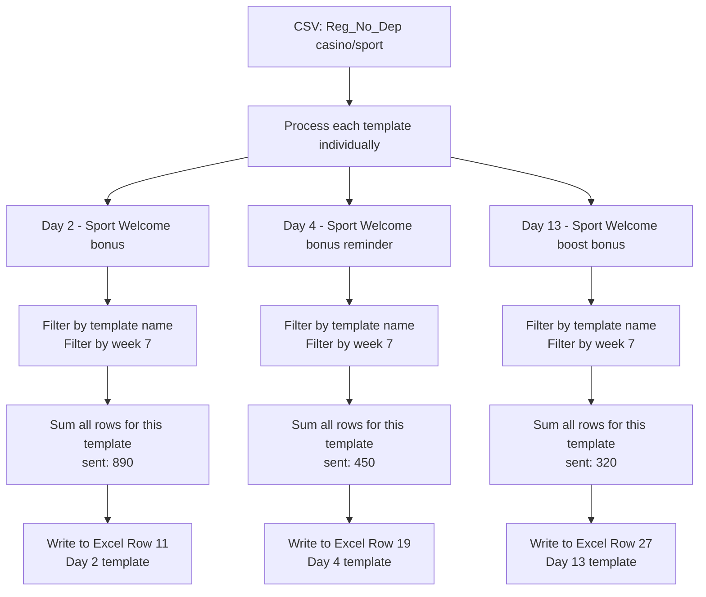
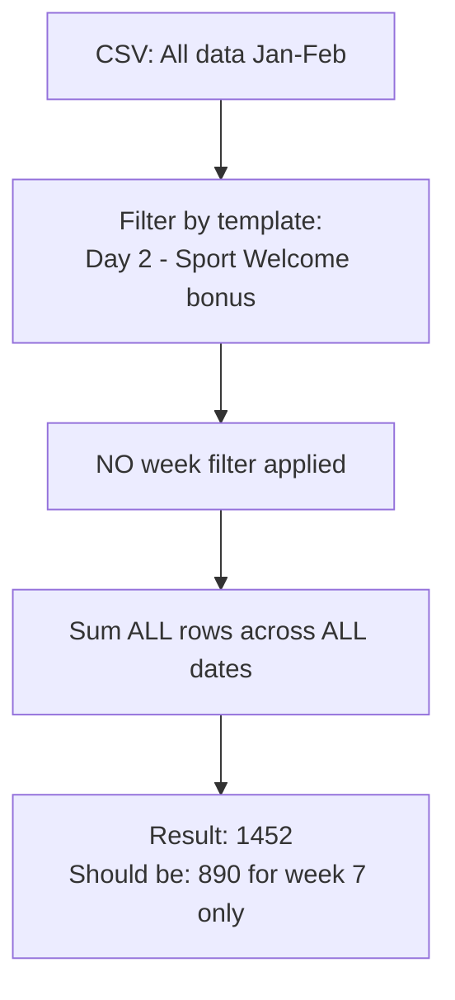
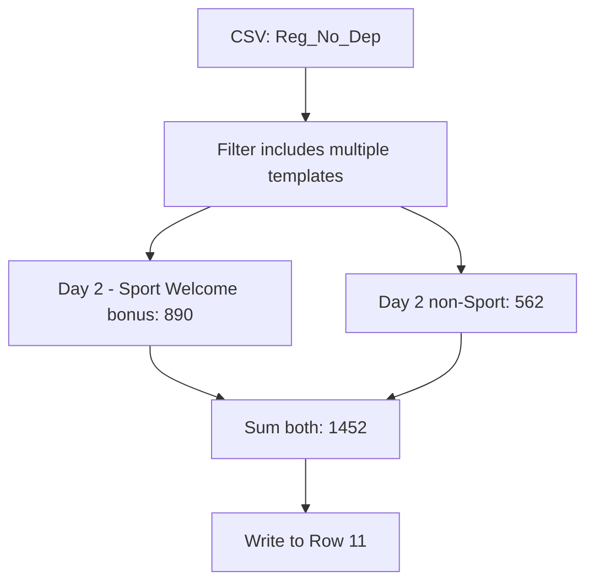
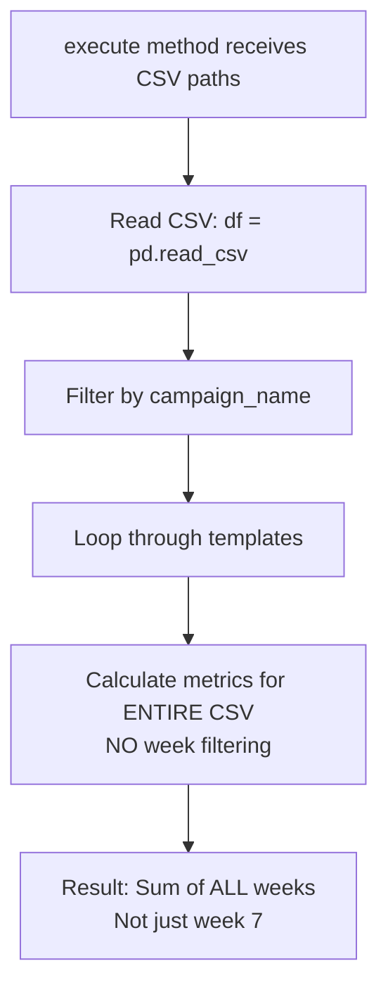
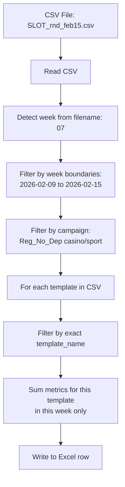

# Slot vs Casino-Ret: Value Calculation Comparison

## Overview

This document compares how values are calculated and written to Excel for **slot** and **casino-ret** report types.

---

## Casino-Ret: Timing Category Aggregation

### Data Flow

```mermaid
flowchart TD
    A[CSV: casino+sport A/B Reg_No_Dep] --> B[Group templates by timing category]
    B --> C[10min: '[S] 10 min sport basic wp']
    B --> D[1h: '[S] 1h sport basic wp']
    B --> E[1d: '[S] 1d 2 BLOCKS...']
    
    C --> F[Aggregate all 10min templates<br/>Sum across all weeks]
    D --> G[Aggregate all 1h templates<br/>Sum across all weeks]
    E --> H[Aggregate all 1d templates<br/>Sum across all weeks]
    
    F --> I[Write to Excel Row 3-8<br/>10min timing block]
    G --> J[Write to Excel Row 9-14<br/>1h timing block]
    H --> K[Write to Excel Row 15-20<br/>1d timing block]
```

### Example Calculation

**CSV Data (Week 7):**
```
template_name                    | sent | delivered | opened
[S] 10 min sport basic wp        | 100  | 95        | 30
[S] 10 min sport basic wp        | 50   | 48        | 15
[S] 10 min sport basic wp        | 30   | 29        | 10
```

**Calculation:**
1. Filter by template: `[S] 10 min sport basic wp`
2. Filter by week 7 date range
3. **Sum all rows**: 100 + 50 + 30 = **180 sent**
4. Write 180 to Excel Row 3 (10min timing block)

**Key Point:** Multiple CSV rows for same template are **SUMMED** together.

---

## Slot: Template-Level Direct Mapping

### Data Flow



### Example Calculation

**CSV Data (Week 7):**
```
template_name                    | sent | delivered | opened
Day 2 - Sport Welcome bonus      | 100  | 95        | 30
Day 2 - Sport Welcome bonus      | 50   | 48        | 15
Day 2 - Sport Welcome bonus      | 30   | 29        | 10
Day 2 - Sport Welcome bonus      | 710  | 680       | 200
```

**Calculation:**
1. Filter by template: `Day 2 - Sport Welcome bonus ` (exact match)
2. Filter by week 7 date range
3. **Sum all rows**: 100 + 50 + 30 + 710 = **890 sent**
4. Write 890 to Excel Row 11 (Day 2 template row)

**Key Point:** Multiple CSV rows for same template are **SUMMED** together.

---

## Current Issue: Why 1452 Instead of 890?

### Hypothesis 1: No Week Filtering



**Problem:** Code might not be filtering by week boundaries before summing.

### Hypothesis 2: Including Multiple Templates



**Problem:** Code might be matching "Day 2" substring instead of exact template name.

### Hypothesis 3: Not Filtering by Week in execute()



**Problem:** The `execute()` method doesn't filter by week boundaries before calculating metrics.

---

## Expected Behavior

### Correct Flow for Slot



### Code Check Points

1. **Week Detection:**
   - ✅ `_detect_week_from_filename()` extracts week number from filename
   - ❓ Is week boundary filtering applied to data?

2. **Template Filtering:**
   - ✅ `df[df['template_name'] == template_name]` filters by exact match
   - ❓ Is this done AFTER week filtering?

3. **Metric Calculation:**
   - ✅ `_calculate_metrics()` sums sent, delivered, opened, etc.
   - ❓ Is the input dataframe already filtered by week?

---

## Comparison Table

| Aspect | Casino-Ret | Slot | Issue? |
|--------|-----------|------|--------|
| **Grouping** | By timing category | By individual template | ✅ |
| **Week Filtering** | Yes, in `transform_data()` | ❓ Unknown | ❓ |
| **Template Match** | Fuzzy (timing category) | Exact (template_name) | ✅ |
| **Aggregation** | Sum within timing block | Sum within template | ✅ |
| **Excel Target** | Timing block rows | Template rows | ✅ |
| **Aggregate Rows** | Skip (has formulas) | Skip (has formulas) | ✅ |

---

## Investigation Needed

### Check 1: Week Filtering in execute()

```python
def execute(self, csv_paths, ...):
    for csv_path in csv_paths:
        df = pd.read_csv(csv_path)
        
        # ❓ IS THERE WEEK FILTERING HERE?
        # Expected:
        # week_start = WEEKLY_BOUNDARIES[week_num][0]
        # week_end = WEEKLY_BOUNDARIES[week_num][1]
        # df = df[(df['datetime'] >= week_start) & (df['datetime'] <= week_end)]
        
        for template_name in df['template_name'].unique():
            template_df = df[df['template_name'] == template_name]
            metrics = self._calculate_metrics(template_df)
```

### Check 2: Template Name Exact Match

```python
# Current:
template_df = df[df['template_name'] == template_name]

# Verify it's not doing:
template_df = df[df['template_name'].str.contains(template_name)]
```

### Check 3: Data Scope

```python
# For "Day 2 - Sport Welcome bonus " in week 7:
# Expected: 890 (week 7 only)
# Actual: 1452 (possibly all weeks)

# Ratio: 1452 / 890 = 1.63
# This suggests data from ~1.6 weeks is being included
```

---

## Recommended Fix

Add week filtering in `execute()` method before calculating metrics:

```python
def execute(self, csv_paths, existing_excel=None, replace_week=None):
    # ... existing code ...
    
    for csv_path in csv_paths:
        df = pd.read_csv(csv_path)
        df['datetime'] = pd.to_datetime(df['timestamp'], unit='s')
        
        # ADD WEEK FILTERING HERE
        week_idx = int(replace_week) - 1
        week_start_str, week_end_str = WEEKLY_BOUNDARIES[week_idx]
        week_start = pd.to_datetime(week_start_str + ' 00:00:00')
        week_end = pd.to_datetime(week_end_str + ' 23:59:59')
        df = df[(df['datetime'] >= week_start) & (df['datetime'] <= week_end)]
        
        # ... rest of code ...
```

This ensures only week 7 data is summed, giving 890 instead of 1452.
